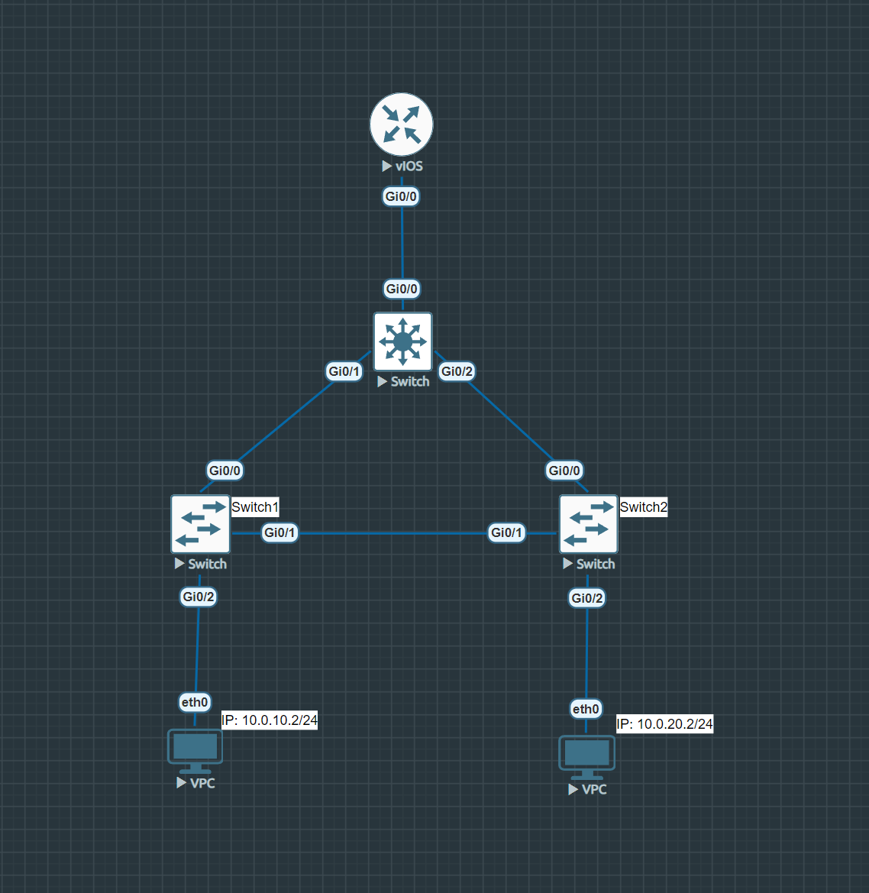

# Лабораторная работа 1

## Фатахов Георгий группа 215

### Скриншот топологии


### Настройка коммутаторов
#### Выполняемые комманды

Входим в конфигурацию
```
Switch>enable
Switch#configure
```

Настройки vlan
```
Switch(config)#vlan 20
```
```
Switch(config)#vlan 20
```

Настройка магистральных интерфейсов (между коммутаторами)
```
Switch(config)#interface Gi0/0 #  нужный интерфейс
Switch(config-if)#switchport trunk encapsulation
Switch(config-if)#switchport trunk encapsulation dot1q
Switch(config-if)#switchport mode trunk
Switch(config-if)#switchport trunk allowed vlan 10,20
Switch(config-if)#exit
```

Настройка интерфейсов (между коммутатором и PC)
```
Switch(config-if)#switchport mode access
Switch(config-if)#switchport access vlan 20 # Нужный VLAN
```

Настройка STP (на коммутаторе уровня распределения)

```
Switch(config)#spanning-tree mode pvst
Switch(config)#spanning-tree extend system-id
Switch(config)#spanning-tree vlan 10,20 priority 0
```

Сохранение конфигурации для отказоустойчивости, на случай перезапуска (на всех коммутаторах)

```
Switch#copy running-config startup-config
Destination filename [startup-config]?
Building configuration...
Compressed configuration from 3258 bytes to 1557 bytes[OK]
Switch#
*Jun 15 22:48:31.350: %GRUB-5-CONFIG_WRITING: GRUB configuration is being updated on disk. Please wait...
*Jun 15 22:48:32.054: %GRUB-5-CONFIG_WRITTEN: GRUB configuration was written to disk successfully.

```

Настройка роутера 
```
% Please answer 'yes' or 'no'.
Would you like to enter the initial configuration dialog? [yes/no]: no
```
```
Router>enable
Router#configure
Router(config-if)#no shutdown
```


```
Router(config-subif)#int Gi0/0.20 # Для каждого интерфейса
Router(config-subif)#encapsulation dot1Q 20
Router(config-subif)#ip address 10.0.20.1 255.255.255.0
```

```
Router#d
```


#### Конфигурация коммутатора уровня распределения 

<details><summary>Текст конфигурации</summary>

```
Switch#show running-config
Building configuration...

Current configuration : 3258 bytes
!
! Last configuration change at 21:00:43 UTC Sat Jun 15 2024
!
version 15.2
service timestamps debug datetime msec
service timestamps log datetime msec
no service password-encryption
service compress-config
!
hostname Switch
!
boot-start-marker
boot-end-marker
!
!
!
no aaa new-model
!
!
!
!
!
!
!
!
ip cef
no ipv6 cef
!
!
!
spanning-tree mode pvst
spanning-tree extend system-id
spanning-tree vlan 10,20 priority 0
!
!
!
!
!
!
!
!
!
!
!
!
!
!
!
interface GigabitEthernet0/0
 switchport trunk allowed vlan 10,20
 switchport trunk encapsulation dot1q
 switchport mode trunk
 negotiation auto
!
interface GigabitEthernet0/1
 switchport trunk allowed vlan 10,20
 switchport trunk encapsulation dot1q
 switchport mode trunk
 negotiation auto
!
interface GigabitEthernet0/2
 switchport trunk allowed vlan 10,20
 switchport trunk encapsulation dot1q
 switchport mode trunk
 negotiation auto
!
interface GigabitEthernet0/3
 negotiation auto
!
interface GigabitEthernet1/0
 negotiation auto
!
interface GigabitEthernet1/1
 negotiation auto
!
interface GigabitEthernet1/2
 negotiation auto
!
interface GigabitEthernet1/3
 negotiation auto
!
ip forward-protocol nd
!
ip http server
ip http secure-server
!
ip ssh server algorithm encryption aes128-ctr aes192-ctr aes256-ctr
ip ssh client algorithm encryption aes128-ctr aes192-ctr aes256-ctr
!
!
!
!
!
!
control-plane
!
banner exec ^C
**************************************************************************
* IOSv is strictly limited to use for evaluation, demonstration and IOS  *
* education. IOSv is provided as-is and is not supported by Cisco's      *
* Technical Advisory Center. Any use or disclosure, in whole or in part, *
* of the IOSv Software or Documentation to any third party for any       *
* purposes is expressly prohibited except as otherwise authorized by     *
* Cisco in writing.                                                      *
**************************************************************************^C
banner incoming ^C
**************************************************************************
* IOSv is strictly limited to use for evaluation, demonstration and IOS  *
* education. IOSv is provided as-is and is not supported by Cisco's      *
* Technical Advisory Center. Any use or disclosure, in whole or in part, *
* of the IOSv Software or Documentation to any third party for any       *
* purposes is expressly prohibited except as otherwise authorized by     *
* Cisco in writing.                                                      *
**************************************************************************^C
banner login ^C
**************************************************************************
* IOSv is strictly limited to use for evaluation, demonstration and IOS  *
* education. IOSv is provided as-is and is not supported by Cisco's      *
* Technical Advisory Center. Any use or disclosure, in whole or in part, *
* of the IOSv Software or Documentation to any third party for any       *
* purposes is expressly prohibited except as otherwise authorized by     *
* Cisco in writing.                                                      *
**************************************************************************^C
!
line con 0
line aux 0
line vty 0 4
!
!
end
```

</details>

[Файл с конфигурацией](data/switch0.txt)


#### Конфигурация коммутатора уровня доступа Switch1

<details><summary>Текст конфигурации</summary>

```
Switch#show running-config
Building configuration...

Current configuration : 3175 bytes
!
! Last configuration change at 21:56:36 UTC Sat Jun 15 2024
!
version 15.2
service timestamps debug datetime msec
service timestamps log datetime msec
no service password-encryption
service compress-config
!
hostname Switch
!
boot-start-marker
boot-end-marker
!
!
!
no aaa new-model
!
!
!
!
!
!
!
!
ip cef
no ipv6 cef
!
!
!
spanning-tree mode pvst
spanning-tree extend system-id
!
!
!
!
!
!
!
!
!
!
!
!
!
!
!
interface GigabitEthernet0/0
 switchport trunk allowed vlan 10,20
 switchport trunk encapsulation dot1q
 switchport mode trunk
 negotiation auto
!
interface GigabitEthernet0/1
 switchport trunk allowed vlan 10,20
 switchport trunk encapsulation dot1q
 switchport mode trunk
 negotiation auto
!
interface GigabitEthernet0/2
 switchport access vlan 10
 switchport mode access
 negotiation auto
!
interface GigabitEthernet0/3
 negotiation auto
!
interface GigabitEthernet1/0
 negotiation auto
!
interface GigabitEthernet1/1
 negotiation auto
!
interface GigabitEthernet1/2
 negotiation auto
!
interface GigabitEthernet1/3
 negotiation auto
!
ip forward-protocol nd
!
ip http server
ip http secure-server
!
ip ssh server algorithm encryption aes128-ctr aes192-ctr aes256-ctr
ip ssh client algorithm encryption aes128-ctr aes192-ctr aes256-ctr
!
!
!
!
!
!
control-plane
!
banner exec ^C
**************************************************************************
* IOSv is strictly limited to use for evaluation, demonstration and IOS  *
* education. IOSv is provided as-is and is not supported by Cisco's      *
* Technical Advisory Center. Any use or disclosure, in whole or in part, *
* of the IOSv Software or Documentation to any third party for any       *
* purposes is expressly prohibited except as otherwise authorized by     *
* Cisco in writing.                                                      *
**************************************************************************^C
banner incoming ^C
**************************************************************************
* IOSv is strictly limited to use for evaluation, demonstration and IOS  *
* education. IOSv is provided as-is and is not supported by Cisco's      *
* Technical Advisory Center. Any use or disclosure, in whole or in part, *
* of the IOSv Software or Documentation to any third party for any       *
* purposes is expressly prohibited except as otherwise authorized by     *
* Cisco in writing.                                                      *
**************************************************************************^C
banner login ^C
**************************************************************************
* IOSv is strictly limited to use for evaluation, demonstration and IOS  *
* education. IOSv is provided as-is and is not supported by Cisco's      *
* Technical Advisory Center. Any use or disclosure, in whole or in part, *
* of the IOSv Software or Documentation to any third party for any       *
* purposes is expressly prohibited except as otherwise authorized by     *
* Cisco in writing.                                                      *
**************************************************************************^C
!
line con 0
line aux 0
line vty 0 4
!
!
end
```

</details>


[Файл с конфигурацией](data/switch1.txt)


#### Конфигурация коммутатора уровня доступа Switch2

<details><summary>Текст конфигурации</summary>

```
Switch#show running-config
Building configuration...

Current configuration : 3175 bytes
!
! Last configuration change at 22:07:50 UTC Sat Jun 15 2024
!
version 15.2
service timestamps debug datetime msec
service timestamps log datetime msec
no service password-encryption
service compress-config
!
hostname Switch
!
boot-start-marker
boot-end-marker
!
!
!
no aaa new-model
!
!
!
!
!
!
!
!
ip cef
no ipv6 cef
!
!
!
spanning-tree mode pvst
spanning-tree extend system-id
!
!
!
!
!
!
!
!
!
!
!
!
!
!
!
interface GigabitEthernet0/0
 switchport trunk allowed vlan 10,20
 switchport trunk encapsulation dot1q
 switchport mode trunk
 negotiation auto
!
interface GigabitEthernet0/1
 switchport trunk allowed vlan 10,20
 switchport trunk encapsulation dot1q
 switchport mode trunk
 negotiation auto
!
interface GigabitEthernet0/2
 switchport access vlan 20
 switchport mode access
 negotiation auto
!
interface GigabitEthernet0/3
 negotiation auto
!
interface GigabitEthernet1/0
 negotiation auto
!
interface GigabitEthernet1/1
 negotiation auto
!
interface GigabitEthernet1/2
 negotiation auto
!
interface GigabitEthernet1/3
 negotiation auto
!
ip forward-protocol nd
!
ip http server
ip http secure-server
!
ip ssh server algorithm encryption aes128-ctr aes192-ctr aes256-ctr
ip ssh client algorithm encryption aes128-ctr aes192-ctr aes256-ctr
!
!
!
!
!
!
control-plane
!
banner exec ^C
**************************************************************************
* IOSv is strictly limited to use for evaluation, demonstration and IOS  *
* education. IOSv is provided as-is and is not supported by Cisco's      *
* Technical Advisory Center. Any use or disclosure, in whole or in part, *
* of the IOSv Software or Documentation to any third party for any       *
* purposes is expressly prohibited except as otherwise authorized by     *
* Cisco in writing.                                                      *
**************************************************************************^C
banner incoming ^C
**************************************************************************
* IOSv is strictly limited to use for evaluation, demonstration and IOS  *
* education. IOSv is provided as-is and is not supported by Cisco's      *
* Technical Advisory Center. Any use or disclosure, in whole or in part, *
* of the IOSv Software or Documentation to any third party for any       *
* purposes is expressly prohibited except as otherwise authorized by     *
* Cisco in writing.                                                      *
**************************************************************************^C
banner login ^C
**************************************************************************
* IOSv is strictly limited to use for evaluation, demonstration and IOS  *
* education. IOSv is provided as-is and is not supported by Cisco's      *
* Technical Advisory Center. Any use or disclosure, in whole or in part, *
* of the IOSv Software or Documentation to any third party for any       *
* purposes is expressly prohibited except as otherwise authorized by     *
* Cisco in writing.                                                      *
**************************************************************************^C
!
line con 0
line aux 0
line vty 0 4
!
!
end
```

</details>


[Файл с конфигурацией](data/switch2.txt)


#### Конфигурация роутера

<details><summary>Текст конфигурации</summary>

```
Router#show running-config
Building configuration...

Current configuration : 3059 bytes
!
! Last configuration change at 23:13:16 UTC Sat Jun 15 2024
!
version 15.9
service timestamps debug datetime msec
service timestamps log datetime msec
no service password-encryption
!
hostname Router
!
boot-start-marker
boot-end-marker
!
!
!
no aaa new-model
!
!
!
mmi polling-interval 60
no mmi auto-configure
no mmi pvc
mmi snmp-timeout 180
!
!
!
!
!
!
!
!
!
!
!
ip cef
no ipv6 cef
!
multilink bundle-name authenticated
!
!
!
redundancy
!
!
!
!
!
!
interface GigabitEthernet0/0
 no ip address
 duplex auto
 speed auto
 media-type rj45
!
interface GigabitEthernet0/0.10
 encapsulation dot1Q 10
 ip address 10.0.10.1 255.255.255.0
!
interface GigabitEthernet0/0.20
 encapsulation dot1Q 20
 ip address 10.0.20.1 255.255.255.0
!
interface GigabitEthernet0/1
 no ip address
 shutdown
 duplex auto
 speed auto
 media-type rj45
!
interface GigabitEthernet0/2
 no ip address
 shutdown
 duplex auto
 speed auto
 media-type rj45
!
interface GigabitEthernet0/3
 no ip address
 shutdown
 duplex auto
 speed auto
 media-type rj45
!
ip forward-protocol nd
!
!
no ip http server
!
ipv6 ioam timestamp
!
!
!
control-plane
!
banner exec ^C
**************************************************************************
* IOSv is strictly limited to use for evaluation, demonstration and IOS  *
* education. IOSv is provided as-is and is not supported by Cisco's      *
* Technical Advisory Center. Any use or disclosure, in whole or in part, *
* of the IOSv Software or Documentation to any third party for any       *
* purposes is expressly prohibited except as otherwise authorized by     *
* Cisco in writing.                                                      *
**************************************************************************^C
banner incoming ^C
**************************************************************************
* IOSv is strictly limited to use for evaluation, demonstration and IOS  *
* education. IOSv is provided as-is and is not supported by Cisco's      *
* Technical Advisory Center. Any use or disclosure, in whole or in part, *
* of the IOSv Software or Documentation to any third party for any       *
* purposes is expressly prohibited except as otherwise authorized by     *
* Cisco in writing.                                                      *
**************************************************************************^C
banner login ^C
**************************************************************************
* IOSv is strictly limited to use for evaluation, demonstration and IOS  *
* education. IOSv is provided as-is and is not supported by Cisco's      *
* Technical Advisory Center. Any use or disclosure, in whole or in part, *
* of the IOSv Software or Documentation to any third party for any       *
* purposes is expressly prohibited except as otherwise authorized by     *
* Cisco in writing.                                                      *
**************************************************************************^C
!
line con 0
line aux 0
line vty 0 4
 login
 transport input none
!
no scheduler allocate
!
end
```

</details>


[Файл с конфигурацией](data/router.txt)


### Проверка STP

#### Коммутатор уровня распределения является корнем сети для обоих VLAN

Узнаем mac адрес коммутатора уровня распределения

```
Switch#show interfaces
GigabitEthernet0/0 is up, line protocol is up (connected)
  Hardware is iGbE, address is 5000.0006.0000 (bia 5000.0006.0000)
```

Наш mac адрес `5000.0006.0000` 

Теперь выведем `spanning-tree`

<details><summary>Spanning-tree коммутатора уровня распределения</summary>


```
Switch#show spanning-tree

VLAN0001
  Spanning tree enabled protocol ieee
  Root ID    Priority    32769
             Address     5000.0006.0000
             This bridge is the root
             Hello Time   2 sec  Max Age 20 sec  Forward Delay 15 sec

  Bridge ID  Priority    32769  (priority 32768 sys-id-ext 1)
             Address     5000.0006.0000
             Hello Time   2 sec  Max Age 20 sec  Forward Delay 15 sec
             Aging Time  300 sec

Interface           Role Sts Cost      Prio.Nbr Type
------------------- ---- --- --------- -------- --------------------------------
Gi0/3               Desg FWD 4         128.4    P2p
Gi1/0               Desg FWD 4         128.5    P2p
Gi1/1               Desg FWD 4         128.6    P2p
Gi1/2               Desg FWD 4         128.7    P2p
Gi1/3               Desg FWD 4         128.8    P2p


VLAN0010
  Spanning tree enabled protocol ieee
  Root ID    Priority    10
             Address     5000.0006.0000
             This bridge is the root
             Hello Time   2 sec  Max Age 20 sec  Forward Delay 15 sec

  Bridge ID  Priority    10     (priority 0 sys-id-ext 10)
             Address     5000.0006.0000
             Hello Time   2 sec  Max Age 20 sec  Forward Delay 15 sec
             Aging Time  300 sec

Interface           Role Sts Cost      Prio.Nbr Type
------------------- ---- --- --------- -------- --------------------------------
Gi0/0               Desg FWD 4         128.1    P2p
Gi0/1               Desg FWD 4         128.2    P2p
Gi0/2               Desg FWD 4         128.3    P2p


VLAN0020
  Spanning tree enabled protocol ieee
  Root ID    Priority    20
             Address     5000.0006.0000
             This bridge is the root
             Hello Time   2 sec  Max Age 20 sec  Forward Delay 15 sec

  Bridge ID  Priority    20     (priority 0 sys-id-ext 20)
             Address     5000.0006.0000
             Hello Time   2 sec  Max Age 20 sec  Forward Delay 15 sec
             Aging Time  300 sec

Interface           Role Sts Cost      Prio.Nbr Type
------------------- ---- --- --------- -------- --------------------------------
Gi0/0               Desg FWD 4         128.1    P2p
Gi0/1               Desg FWD 4         128.2    P2p
Gi0/2               Desg FWD 4         128.3    P2p
```


</details>


<details><summary>Spanning-tree Switch1</summary>

```
Switch#show spanning-tree

VLAN0001
  Spanning tree enabled protocol ieee
  Root ID    Priority    32769
             Address     5000.0001.0000
             This bridge is the root
             Hello Time   2 sec  Max Age 20 sec  Forward Delay 15 sec

  Bridge ID  Priority    32769  (priority 32768 sys-id-ext 1)
             Address     5000.0001.0000
             Hello Time   2 sec  Max Age 20 sec  Forward Delay 15 sec
             Aging Time  300 sec

Interface           Role Sts Cost      Prio.Nbr Type
------------------- ---- --- --------- -------- --------------------------------
Gi0/3               Desg FWD 4         128.4    P2p
Gi1/0               Desg FWD 4         128.5    P2p
Gi1/1               Desg FWD 4         128.6    P2p
Gi1/2               Desg FWD 4         128.7    P2p
Gi1/3               Desg FWD 4         128.8    P2p


VLAN0010
  Spanning tree enabled protocol ieee
  Root ID    Priority    10
             Address     5000.0006.0000
             Cost        4
             Port        1 (GigabitEthernet0/0)
             Hello Time   2 sec  Max Age 20 sec  Forward Delay 15 sec

  Bridge ID  Priority    32778  (priority 32768 sys-id-ext 10)
             Address     5000.0001.0000
             Hello Time   2 sec  Max Age 20 sec  Forward Delay 15 sec
             Aging Time  300 sec

Interface           Role Sts Cost      Prio.Nbr Type
------------------- ---- --- --------- -------- --------------------------------
Gi0/0               Root FWD 4         128.1    P2p
Gi0/1               Desg FWD 4         128.2    P2p
Gi0/2               Desg FWD 4         128.3    P2p


VLAN0020
  Spanning tree enabled protocol ieee
  Root ID    Priority    20
             Address     5000.0006.0000
             Cost        4
             Port        1 (GigabitEthernet0/0)
             Hello Time   2 sec  Max Age 20 sec  Forward Delay 15 sec

  Bridge ID  Priority    32788  (priority 32768 sys-id-ext 20)
             Address     5000.0001.0000
             Hello Time   2 sec  Max Age 20 sec  Forward Delay 15 sec
             Aging Time  300 sec

Interface           Role Sts Cost      Prio.Nbr Type
------------------- ---- --- --------- -------- --------------------------------
Gi0/0               Root FWD 4         128.1    P2p
Gi0/1               Desg FWD 4         128.2    P2p

```

</details>


<details><summary>Spanning-tree Switch2</summary>

```

Switch#show spanning-tree

VLAN0001
  Spanning tree enabled protocol ieee
  Root ID    Priority    32769
             Address     5000.0004.0000
             This bridge is the root
             Hello Time   2 sec  Max Age 20 sec  Forward Delay 15 sec

  Bridge ID  Priority    32769  (priority 32768 sys-id-ext 1)
             Address     5000.0004.0000
             Hello Time   2 sec  Max Age 20 sec  Forward Delay 15 sec
             Aging Time  15  sec

Interface           Role Sts Cost      Prio.Nbr Type
------------------- ---- --- --------- -------- --------------------------------
Gi0/3               Desg FWD 4         128.4    P2p
Gi1/0               Desg FWD 4         128.5    P2p
Gi1/1               Desg FWD 4         128.6    P2p
Gi1/2               Desg FWD 4         128.7    P2p
Gi1/3               Desg FWD 4         128.8    P2p


VLAN0010
  Spanning tree enabled protocol ieee
  Root ID    Priority    10
             Address     5000.0006.0000
             Cost        4
             Port        1 (GigabitEthernet0/0)
             Hello Time   2 sec  Max Age 20 sec  Forward Delay 15 sec

  Bridge ID  Priority    32778  (priority 32768 sys-id-ext 10)
             Address     5000.0004.0000
             Hello Time   2 sec  Max Age 20 sec  Forward Delay 15 sec
             Aging Time  300 sec

Interface           Role Sts Cost      Prio.Nbr Type
------------------- ---- --- --------- -------- --------------------------------
Gi0/0               Root FWD 4         128.1    P2p
Gi0/1               Altn BLK 4         128.2    P2p


VLAN0020
  Spanning tree enabled protocol ieee
  Root ID    Priority    20
             Address     5000.0006.0000
             Cost        4
             Port        1 (GigabitEthernet0/0)
             Hello Time   2 sec  Max Age 20 sec  Forward Delay 15 sec

  Bridge ID  Priority    32788  (priority 32768 sys-id-ext 20)
             Address     5000.0004.0000
             Hello Time   2 sec  Max Age 20 sec  Forward Delay 15 sec
             Aging Time  300 sec

Interface           Role Sts Cost      Prio.Nbr Type
------------------- ---- --- --------- -------- --------------------------------
Gi0/0               Root FWD 4         128.1    P2p
Gi0/1               Altn BLK 4         128.2    P2p
Gi0/2               Desg LRN 4         128.3    P2p
```

</details>

Заметим, во всех трех VLAN mac адрес корня является адресом коммутатора уровня распределения.

**! Также заметим, что у switch2 интерфейс `Gi0/1` является альтернативным (`Altn`), то есть линк между коммутаторами уровня доступа заблокирован.**

## Настройка PC


#### Настройка PC1
```
VPCS> ip 10.0.10.2/24 10.0.10.1
Checking for duplicate address...
VPCS : 10.0.10.2 255.255.255.0 gateway 10.0.10.1
```

#### Настройка PC2
```
VPCS> ip 10.0.20.2/24 10.0.20.1
Checking for duplicate address...
VPCS : 10.0.20.2 255.255.255.0 gateway 10.0.20.1
```


### Резульаты

#### Пинг из PC1 в PC2:
```
VPCS> ping 10.0.20.2

84 bytes from 10.0.20.2 icmp_seq=1 ttl=63 time=19.565 ms
84 bytes from 10.0.20.2 icmp_seq=2 ttl=63 time=16.112 ms
84 bytes from 10.0.20.2 icmp_seq=3 ttl=63 time=8.323 ms
84 bytes from 10.0.20.2 icmp_seq=4 ttl=63 time=11.120 ms
84 bytes from 10.0.20.2 icmp_seq=5 ttl=63 time=6.707 ms
```

#### Проверка отказоустойчивости:

Отключаем первый интерфейс

```
Switch(config)#int Gi0/2
Switch(config-if)#shutdown
*Jun 15 23:23:06.824: %LINK-5-CHANGED: Interface GigabitEthernet0/2, changed state to administratively down
*Jun 15 23:23:07.824: %LINEPROTO-5-UPDOWN: Line protocol on Interface GigabitEthernet0/2, changed state to down
```

После ожидания перестройки spaning-tree, пинги проходят:

```
VPCS> ping 10.0.20.2

84 bytes from 10.0.20.2 icmp_seq=1 ttl=63 time=28.096 ms
84 bytes from 10.0.20.2 icmp_seq=2 ttl=63 time=15.267 ms
84 bytes from 10.0.20.2 icmp_seq=3 ttl=63 time=16.192 ms
84 bytes from 10.0.20.2 icmp_seq=4 ttl=63 time=17.603 ms
84 bytes from 10.0.20.2 icmp_seq=5 ttl=63 time=16.260 ms
```

Таким образом за счет отказоустойчивости (правильной настройки stp),
при отключении одного интерфейса, пинги проходят.
