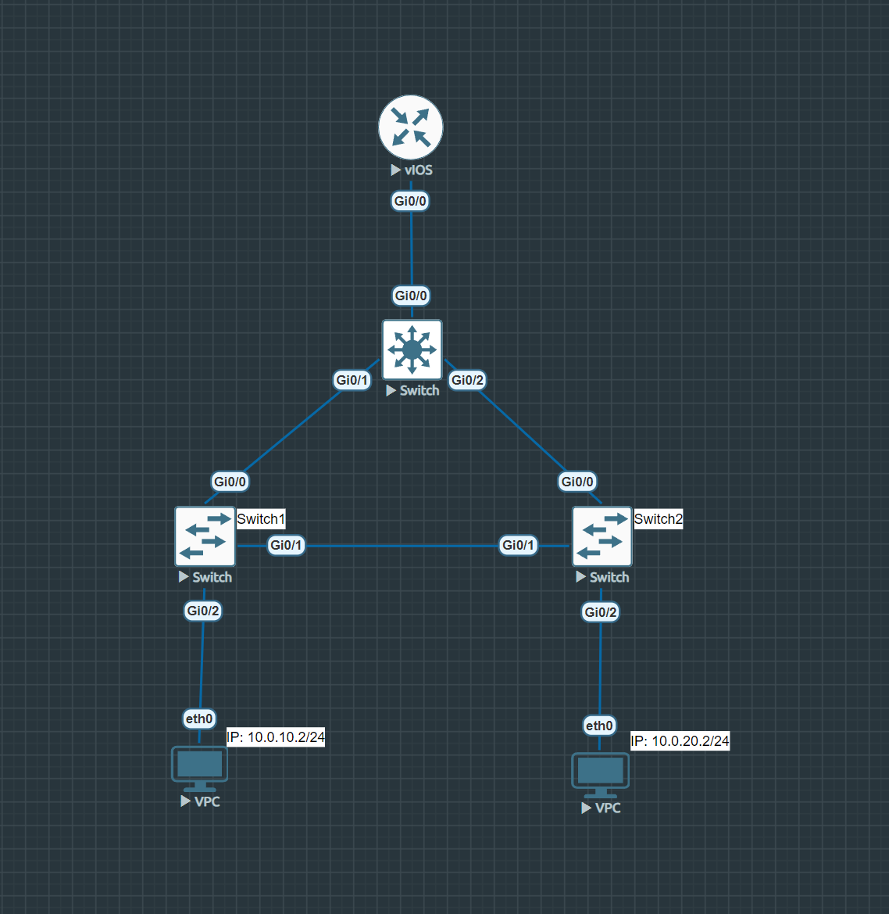

# Лабораторная работа 1

## Фатахов Георгий группа 2

### Скриншот топологии


### Конфигурации коммутаторов
#### Конфигурация коммутатора уровня распределения 

<details><summary>Текст конфигурации</summary>

```
Switch#show running-config
Building configuration...

Current configuration : 3258 bytes
!
! Last configuration change at 21:00:43 UTC Sat Jun 15 2024
!
version 15.2
service timestamps debug datetime msec
service timestamps log datetime msec
no service password-encryption
service compress-config
!
hostname Switch
!
boot-start-marker
boot-end-marker
!
!
!
no aaa new-model
!
!
!
!
!
!
!
!
ip cef
no ipv6 cef
!
!
!
spanning-tree mode pvst
spanning-tree extend system-id
spanning-tree vlan 10,20 priority 0
!
!
!
!
!
!
!
!
!
!
!
!
!
!
!
interface GigabitEthernet0/0
 switchport trunk allowed vlan 10,20
 switchport trunk encapsulation dot1q
 switchport mode trunk
 negotiation auto
!
interface GigabitEthernet0/1
 switchport trunk allowed vlan 10,20
 switchport trunk encapsulation dot1q
 switchport mode trunk
 negotiation auto
!
interface GigabitEthernet0/2
 switchport trunk allowed vlan 10,20
 switchport trunk encapsulation dot1q
 switchport mode trunk
 negotiation auto
!
interface GigabitEthernet0/3
 negotiation auto
!
interface GigabitEthernet1/0
 negotiation auto
!
interface GigabitEthernet1/1
 negotiation auto
!
interface GigabitEthernet1/2
 negotiation auto
!
interface GigabitEthernet1/3
 negotiation auto
!
ip forward-protocol nd
!
ip http server
ip http secure-server
!
ip ssh server algorithm encryption aes128-ctr aes192-ctr aes256-ctr
ip ssh client algorithm encryption aes128-ctr aes192-ctr aes256-ctr
!
!
!
!
!
!
control-plane
!
banner exec ^C
**************************************************************************
* IOSv is strictly limited to use for evaluation, demonstration and IOS  *
* education. IOSv is provided as-is and is not supported by Cisco's      *
* Technical Advisory Center. Any use or disclosure, in whole or in part, *
* of the IOSv Software or Documentation to any third party for any       *
* purposes is expressly prohibited except as otherwise authorized by     *
* Cisco in writing.                                                      *
**************************************************************************^C
banner incoming ^C
**************************************************************************
* IOSv is strictly limited to use for evaluation, demonstration and IOS  *
* education. IOSv is provided as-is and is not supported by Cisco's      *
* Technical Advisory Center. Any use or disclosure, in whole or in part, *
* of the IOSv Software or Documentation to any third party for any       *
* purposes is expressly prohibited except as otherwise authorized by     *
* Cisco in writing.                                                      *
**************************************************************************^C
banner login ^C
**************************************************************************
* IOSv is strictly limited to use for evaluation, demonstration and IOS  *
* education. IOSv is provided as-is and is not supported by Cisco's      *
* Technical Advisory Center. Any use or disclosure, in whole or in part, *
* of the IOSv Software or Documentation to any third party for any       *
* purposes is expressly prohibited except as otherwise authorized by     *
* Cisco in writing.                                                      *
**************************************************************************^C
!
line con 0
line aux 0
line vty 0 4
!
!
end
```

</details>


#### Конфигурация коммутатора уровня доступа Switch1

<details><summary>Текст конфигурации</summary>

```
Switch#show running-config
Building configuration...

Current configuration : 3175 bytes
!
! Last configuration change at 21:56:36 UTC Sat Jun 15 2024
!
version 15.2
service timestamps debug datetime msec
service timestamps log datetime msec
no service password-encryption
service compress-config
!
hostname Switch
!
boot-start-marker
boot-end-marker
!
!
!
no aaa new-model
!
!
!
!
!
!
!
!
ip cef
no ipv6 cef
!
!
!
spanning-tree mode pvst
spanning-tree extend system-id
!
!
!
!
!
!
!
!
!
!
!
!
!
!
!
interface GigabitEthernet0/0
 switchport trunk allowed vlan 10,20
 switchport trunk encapsulation dot1q
 switchport mode trunk
 negotiation auto
!
interface GigabitEthernet0/1
 switchport trunk allowed vlan 10,20
 switchport trunk encapsulation dot1q
 switchport mode trunk
 negotiation auto
!
interface GigabitEthernet0/2
 switchport access vlan 10
 switchport mode access
 negotiation auto
!
interface GigabitEthernet0/3
 negotiation auto
!
interface GigabitEthernet1/0
 negotiation auto
!
interface GigabitEthernet1/1
 negotiation auto
!
interface GigabitEthernet1/2
 negotiation auto
!
interface GigabitEthernet1/3
 negotiation auto
!
ip forward-protocol nd
!
ip http server
ip http secure-server
!
ip ssh server algorithm encryption aes128-ctr aes192-ctr aes256-ctr
ip ssh client algorithm encryption aes128-ctr aes192-ctr aes256-ctr
!
!
!
!
!
!
control-plane
!
banner exec ^C
**************************************************************************
* IOSv is strictly limited to use for evaluation, demonstration and IOS  *
* education. IOSv is provided as-is and is not supported by Cisco's      *
* Technical Advisory Center. Any use or disclosure, in whole or in part, *
* of the IOSv Software or Documentation to any third party for any       *
* purposes is expressly prohibited except as otherwise authorized by     *
* Cisco in writing.                                                      *
**************************************************************************^C
banner incoming ^C
**************************************************************************
* IOSv is strictly limited to use for evaluation, demonstration and IOS  *
* education. IOSv is provided as-is and is not supported by Cisco's      *
* Technical Advisory Center. Any use or disclosure, in whole or in part, *
* of the IOSv Software or Documentation to any third party for any       *
* purposes is expressly prohibited except as otherwise authorized by     *
* Cisco in writing.                                                      *
**************************************************************************^C
banner login ^C
**************************************************************************
* IOSv is strictly limited to use for evaluation, demonstration and IOS  *
* education. IOSv is provided as-is and is not supported by Cisco's      *
* Technical Advisory Center. Any use or disclosure, in whole or in part, *
* of the IOSv Software or Documentation to any third party for any       *
* purposes is expressly prohibited except as otherwise authorized by     *
* Cisco in writing.                                                      *
**************************************************************************^C
!
line con 0
line aux 0
line vty 0 4
!
!
end
```

</details>


[Файл с конфигурацией](data/switch1.txt)


#### Конфигурация коммутатора уровня доступа Switch2

<details><summary>Текст конфигурации</summary>

```
Switch#show running-config
Building configuration...

Current configuration : 3175 bytes
!
! Last configuration change at 22:07:50 UTC Sat Jun 15 2024
!
version 15.2
service timestamps debug datetime msec
service timestamps log datetime msec
no service password-encryption
service compress-config
!
hostname Switch
!
boot-start-marker
boot-end-marker
!
!
!
no aaa new-model
!
!
!
!
!
!
!
!
ip cef
no ipv6 cef
!
!
!
spanning-tree mode pvst
spanning-tree extend system-id
!
!
!
!
!
!
!
!
!
!
!
!
!
!
!
interface GigabitEthernet0/0
 switchport trunk allowed vlan 10,20
 switchport trunk encapsulation dot1q
 switchport mode trunk
 negotiation auto
!
interface GigabitEthernet0/1
 switchport trunk allowed vlan 10,20
 switchport trunk encapsulation dot1q
 switchport mode trunk
 negotiation auto
!
interface GigabitEthernet0/2
 switchport access vlan 20
 switchport mode access
 negotiation auto
!
interface GigabitEthernet0/3
 negotiation auto
!
interface GigabitEthernet1/0
 negotiation auto
!
interface GigabitEthernet1/1
 negotiation auto
!
interface GigabitEthernet1/2
 negotiation auto
!
interface GigabitEthernet1/3
 negotiation auto
!
ip forward-protocol nd
!
ip http server
ip http secure-server
!
ip ssh server algorithm encryption aes128-ctr aes192-ctr aes256-ctr
ip ssh client algorithm encryption aes128-ctr aes192-ctr aes256-ctr
!
!
!
!
!
!
control-plane
!
banner exec ^C
**************************************************************************
* IOSv is strictly limited to use for evaluation, demonstration and IOS  *
* education. IOSv is provided as-is and is not supported by Cisco's      *
* Technical Advisory Center. Any use or disclosure, in whole or in part, *
* of the IOSv Software or Documentation to any third party for any       *
* purposes is expressly prohibited except as otherwise authorized by     *
* Cisco in writing.                                                      *
**************************************************************************^C
banner incoming ^C
**************************************************************************
* IOSv is strictly limited to use for evaluation, demonstration and IOS  *
* education. IOSv is provided as-is and is not supported by Cisco's      *
* Technical Advisory Center. Any use or disclosure, in whole or in part, *
* of the IOSv Software or Documentation to any third party for any       *
* purposes is expressly prohibited except as otherwise authorized by     *
* Cisco in writing.                                                      *
**************************************************************************^C
banner login ^C
**************************************************************************
* IOSv is strictly limited to use for evaluation, demonstration and IOS  *
* education. IOSv is provided as-is and is not supported by Cisco's      *
* Technical Advisory Center. Any use or disclosure, in whole or in part, *
* of the IOSv Software or Documentation to any third party for any       *
* purposes is expressly prohibited except as otherwise authorized by     *
* Cisco in writing.                                                      *
**************************************************************************^C
!
line con 0
line aux 0
line vty 0 4
!
!
end
```

</details>


[Файл с конфигурацией](data/switch2.txt)


<details><summary>Spanning-tree</summary>

```

Switch#show spanning-tree

VLAN0001
  Spanning tree enabled protocol ieee
  Root ID    Priority    32769
             Address     5000.0004.0000
             This bridge is the root
             Hello Time   2 sec  Max Age 20 sec  Forward Delay 15 sec

  Bridge ID  Priority    32769  (priority 32768 sys-id-ext 1)
             Address     5000.0004.0000
             Hello Time   2 sec  Max Age 20 sec  Forward Delay 15 sec
             Aging Time  15  sec

Interface           Role Sts Cost      Prio.Nbr Type
------------------- ---- --- --------- -------- --------------------------------
Gi0/3               Desg FWD 4         128.4    P2p
Gi1/0               Desg FWD 4         128.5    P2p
Gi1/1               Desg FWD 4         128.6    P2p
Gi1/2               Desg FWD 4         128.7    P2p
Gi1/3               Desg FWD 4         128.8    P2p


VLAN0010
  Spanning tree enabled protocol ieee
  Root ID    Priority    10
             Address     5000.0006.0000
             Cost        4
             Port        1 (GigabitEthernet0/0)
             Hello Time   2 sec  Max Age 20 sec  Forward Delay 15 sec

  Bridge ID  Priority    32778  (priority 32768 sys-id-ext 10)
             Address     5000.0004.0000
             Hello Time   2 sec  Max Age 20 sec  Forward Delay 15 sec
             Aging Time  300 sec

Interface           Role Sts Cost      Prio.Nbr Type
------------------- ---- --- --------- -------- --------------------------------
Gi0/0               Root FWD 4         128.1    P2p
Gi0/1               Altn BLK 4         128.2    P2p


VLAN0020
  Spanning tree enabled protocol ieee
  Root ID    Priority    20
             Address     5000.0006.0000
             Cost        4
             Port        1 (GigabitEthernet0/0)
             Hello Time   2 sec  Max Age 20 sec  Forward Delay 15 sec

  Bridge ID  Priority    32788  (priority 32768 sys-id-ext 20)
             Address     5000.0004.0000
             Hello Time   2 sec  Max Age 20 sec  Forward Delay 15 sec
             Aging Time  300 sec

Interface           Role Sts Cost      Prio.Nbr Type
------------------- ---- --- --------- -------- --------------------------------
Gi0/0               Root FWD 4         128.1    P2p
Gi0/1               Altn BLK 4         128.2    P2p
Gi0/2               Desg LRN 4         128.3    P2p


```

</details>


### Проверка STP

#### Коммутатор уровня распределения является корнем сети для обоих VLAN

Узнаем mac адрес коммутатора уровня распределения

```
Switch#show interfaces
GigabitEthernet0/0 is up, line protocol is up (connected)
  Hardware is iGbE, address is 5000.0006.0000 (bia 5000.0006.0000)
```

Наш mac адрес `5000.0006.0000` 

Теперь выведем `spanning-tree`
```
Switch#show spanning-tree

VLAN0001
  Spanning tree enabled protocol ieee
  Root ID    Priority    32769
             Address     5000.0006.0000
             This bridge is the root
             Hello Time   2 sec  Max Age 20 sec  Forward Delay 15 sec

  Bridge ID  Priority    32769  (priority 32768 sys-id-ext 1)
             Address     5000.0006.0000
             Hello Time   2 sec  Max Age 20 sec  Forward Delay 15 sec
             Aging Time  300 sec

Interface           Role Sts Cost      Prio.Nbr Type
------------------- ---- --- --------- -------- --------------------------------
Gi0/3               Desg FWD 4         128.4    P2p
Gi1/0               Desg FWD 4         128.5    P2p
Gi1/1               Desg FWD 4         128.6    P2p
Gi1/2               Desg FWD 4         128.7    P2p
Gi1/3               Desg FWD 4         128.8    P2p


VLAN0010
  Spanning tree enabled protocol ieee
  Root ID    Priority    10
             Address     5000.0006.0000
             This bridge is the root
             Hello Time   2 sec  Max Age 20 sec  Forward Delay 15 sec

  Bridge ID  Priority    10     (priority 0 sys-id-ext 10)
             Address     5000.0006.0000
             Hello Time   2 sec  Max Age 20 sec  Forward Delay 15 sec
             Aging Time  300 sec

Interface           Role Sts Cost      Prio.Nbr Type
------------------- ---- --- --------- -------- --------------------------------
Gi0/0               Desg FWD 4         128.1    P2p
Gi0/1               Desg FWD 4         128.2    P2p
Gi0/2               Desg FWD 4         128.3    P2p


VLAN0020
  Spanning tree enabled protocol ieee
  Root ID    Priority    20
             Address     5000.0006.0000
             This bridge is the root
             Hello Time   2 sec  Max Age 20 sec  Forward Delay 15 sec

  Bridge ID  Priority    20     (priority 0 sys-id-ext 20)
             Address     5000.0006.0000
             Hello Time   2 sec  Max Age 20 sec  Forward Delay 15 sec
             Aging Time  300 sec

Interface           Role Sts Cost      Prio.Nbr Type
------------------- ---- --- --------- -------- --------------------------------
Gi0/0               Desg FWD 4         128.1    P2p
Gi0/1               Desg FWD 4         128.2    P2p
Gi0/2               Desg FWD 4         128.3    P2p
```

Заметим, во всех трех VLAN mac адрес корня является адресом коммутатора уровня распределения.
